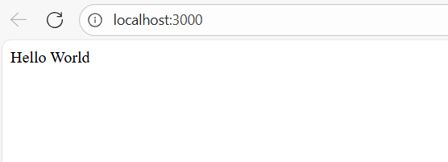
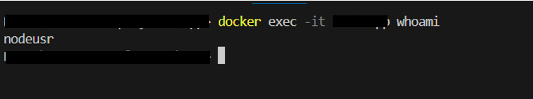
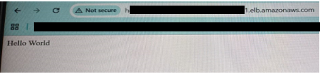
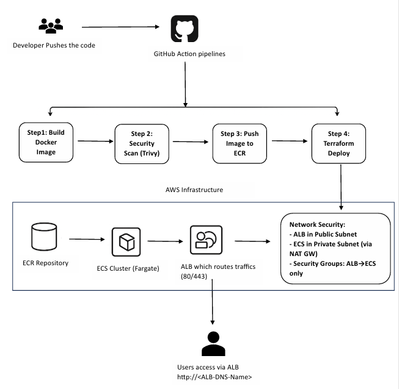

# AWS ECS Deployment

This project demonstrates a full DevOps workflow: containerizing a Node.js application, provisioning infrastructure using Terraform, automating deployment to AWS ECS, implementing DevSecOps best practices, and showcasing Linux administration tasks.

## 1. Project Overview

The goal of this project is to build, secure, and deploy a simple Node.js web application using **Docker**, **Amazon ECS (Fargate)**, **Terraform**, and **GitHub Actions (CI/CD)**.  

The application returns a simple "Hello World" response and is deployed behind an **Application Load Balancer**. The entire workflow demonstrates the DevOps lifecycle — from code to production.

## 2. Prerequisites

Before starting, ensure the following tools are installed and configured:

| Tool | Description |
|------|--------------|
| **Docker Desktop** | Build and run containers locally |
| **Terraform v1.5+** | Define and deploy AWS infrastructure as code |
| **AWS CLI** | Authenticate and manage AWS resources |
| **Node.js 18+** | Run the Node.js web application |
| **Git** | Version control and GitHub repository integration |
| **GitHub Actions** | Automate CI/CD and deployments with OIDC |

> **Note:** Ensure your AWS CLI or OIDC IAM role has permissions for ECR, ECS, IAM, and VPC services.

## 3. Architecture Summary

### Components
- **Application Layer:** Node.js web application containerized using Docker.
- **Container Registry:** Amazon Elastic Container Registry (ECR) for storing built images.
- **Compute Layer:** Amazon Elastic Container Service (ECS) using Fargate launch type.
- **Networking:** Custom VPC with public and private subnets, Security Groups, and ALB.
- **Infrastructure as Code:** Terraform modules for modular infrastructure provisioning.
- **CI/CD:** GitHub Actions workflow to build, scan, push, and deploy automatically.
- **Security:** Secrets managed via AWS Secrets Manager, IAM least privilege roles, and non-root Docker users.

## 4. Project Structure
```
AWS-ECS-Deployment/
├── app/                              # Node.js Application Code
│   ├── .dockerignore                 # Excludes unnecessary files from Docker build
│   ├── Dockerfile                    # Multi-stage Docker build for Node.js app
│   ├── index.js                      # Express/HTTP app entry point
│   ├── package.json                  # Node.js dependencies and metadata
│   └── package-lock.json             # Lockfile for deterministic builds
│
├── terraform/                        # Terraform Infrastructure as Code
│   ├── main.tf                       # Root Terraform file integrating all modules
│   ├── variables.tf                  # Input variables used across modules
│   ├── outputs.tf                    # Terraform outputs (ALB DNS, ECR URL, etc.)
│   ├── modules/                      # Custom Terraform modules
│   │   ├── alb/                      # Application Load Balancer configuration
│   │   │   ├── main.tf
│   │   │   └── variables.tf
│   │   ├── ecs/                      # ECS Cluster, Task, and Service definitions
│   │   │   ├── main.tf
│   │   │   └── variables.tf
│   │   ├── ecr/                      # ECR Repository configuration
│   │   │   ├── main.tf
│   │   │   └── variables.tf
│   │   └── network/                  # VPC, Subnets, NAT, Internet Gateway
│   │       ├── main.tf
│   │       └── variables.tf
│
├── scripts/                          # Linux scripts
│   ├── analysis.sh                   # Automated disk usage & log error analysis script
│   └── LinuxTasks.md                 # Documentation for Linux scripting, troubleshooting, and security hardening
│
├── .github/
│   └── workflows/
│       └── build-scan-deploy.yml     # CI/CD pipeline for build → scan → push → deploy
│
├── images/                           # Screenshots for documentation
│   ├── alb-dns-output.png            # Output showing ALB DNS endpoint running Hello World
│   ├── docker-container-running.png  # Screenshot of Docker container running locally
│   └── verify-non-root-user.png      # Screenshot showing container running as non-root user
│
├── .gitignore                        # Ignore Terraform state, node_modules, etc.
├── README.md                         # Full documentation (overview, usage, CI/CD, Terraform, Docker, etc.)
```
## 5. Step-by-Step Explanation

## 5.1. Application (`app/`) — Node.js + Docker

This directory contains the **Node.js web application** that serves as the core containerized service deployed on ECS.  
It includes source code, dependencies, and the Dockerfile used for containerization.

### Directory Contents

| File | Description |
|-------|-------------|
| **index.js** | Entry point of the Node.js web app. Typically runs an Express or HTTP server on port `3000`. |
| **package.json** | Lists Node.js dependencies and scripts. |
| **package-lock.json** | Ensures consistent dependency versions across builds. |
| **.dockerignore** | Prevents unnecessary files (like `.git`, `node_modules`) from being sent to the Docker build context. |
| **Dockerfile** | Multi-stage Dockerfile that builds and secures the production-ready image. |

### Dockerfile Overview

The Dockerfile in `app/` uses a **multi-stage build** to ensure small, secure, and efficient images.  
It installs only the required production dependencies and runs the container as a **non-root user**.
See full Dockerfile: [`app/Dockerfile`](./app/Dockerfile)

### Build and Run Locally

Follow these commands to build and test your container locally before pushing to Amazon ECR.

#### Build the Docker image

# From the directory where your Dockerfile is present.
`docker build -t <image-name>:latest .`

# Run the container
`docker run -d -p 3000:3000 --name <container-name> <image-name>:latest`

Explanation:

docker run → Runs a container from the image.

-d → Runs the container in detached mode (in the background).

-p 3000:3000 → Maps port 3000 of the container to port 3000 on your host, allowing access via http://localhost:3000.

--name <container-name> → Assigns a name to the container (useful for referencing later).

<image-name>:latest → The image name and tag to run.

Once the container is running, open your browser and navigate to: `http://localhost:3000`

You should see the application response: Output – Application Running Successfully


# Verify running containers
`docker ps`
This lists all active containers.
You should see your hello-ecs-app container running and exposing port 3000.

# Check logs
`docker logs <container-name>`
This shows application logs (helpful for verifying health checks or requests).

# Verify the running user inside the container
To ensure the container is running as a non-root user, execute:

`docker exec -it <container-name> whoami`
Expected output: 

This verifies that the application inside the container runs as the non-root user nodeusr,
which limits privileges and improves container security.

### 5.2 Terraform Infrastructure

Terraform automates AWS provisioning. It is organized into reusable **modules**:

| Module | Purpose |
|--------|----------|
| `network` | Creates VPC, subnets, and NAT gateway |
| `ecr` | Creates Elastic Container Registry for image storage |
| `alb` | Configures Application Load Balancer for public access |
| `ecs` | Creates ECS cluster, task definitions, and services |

Each resource follows **least privilege** and **security best practices**.

## 5.2.1. Prerequisites

Before running Terraform, ensure the following:

AWS CLI is configured
Terraform Installed
IAM Permissions -> The user or role executing Terraform must have access to manage: VPC, Subnets, Gateways, ECS, ECR, ALB, IAM Roles and Policies

## 5.2.2. Terraform Deployment Commands
After verifying your configuration and planning the infrastructure, you can deploy or destroy your AWS environment using the following commands:

# Initialize Terraform (only required once per setup)
`terraform init`

# Review changes before applying 
`terraform plan`

# Deploy the infrastructure to AWS
`terraform apply (if you want manual confirmation for creating resources) or terraform apply -auto-approve`

Explanation:
```terraform init → Downloads the required providers and initializes your working directory.

terraform plan → Shows what changes Terraform will make before applying.

terraform apply -auto-approve → Creates all resources automatically without asking for manual confirmation.
```
# Accessing the Deployed Application

Once the deployment completes successfully, Terraform will output an Application Load Balancer (ALB) DNS name.

alb_dns_name = "http://<your-alb-endpoint>.elb.amazonaws.com"
Visit that URL in your browser to verify deployment.
You should see your Node.js “Hello World” application running.

# Example output:


# 5.2.3. Destroy Infrastructure
Once testing is complete, clean up AWS resources to avoid unnecessary costs:

`terraform destroy (if you want manual confirmation for destroying the resources) or terraform destroy -auto-approve`

Explanation:
```terraform destroy → Removes all infrastructure defined in your Terraform code.
The -auto-approve flag automatically confirms the destroy action.
```
### 5.3. CI/CD Pipeline (GitHub Actions)

The CI/CD workflow automates the process of building, scanning, and deploying.

**Workflow: `.github/workflows/build-scan-deploy.yml`**

**Steps:**
1. **Checkout** code from GitHub.  
2. **Authenticate** to AWS via **OIDC** (no static keys).  
3. **Build Docker image** and tag it with a version number.  
4. **Scan image** with **Trivy** for vulnerabilities.  
5. **Push image** to Amazon ECR.  
6. **Deploy** using Terraform to ECS.

**OIDC Authentication:**
- Configured via GitHub’s identity provider.
- AWS IAM role (`<role-name>`) assumes permissions securely.

## 6. Working Diagram for the AWS ECS Deployment
The following diagram represents the complete working architecture of the project — from code commit to user access.
It showcases the flow of the CI/CD pipeline (via GitHub Actions) and how the deployed application is served through AWS ECS and ALB.

# Diagram: AWS ECS Deployment Workflow


Explanation:
```Developer pushes code → Triggers the GitHub Actions CI/CD pipeline.
GitHub Actions Workflow → Executes sequential steps:
Build Docker Image from the app source (/app directory).
Security Scan (Trivy) ensures container image compliance.
Push to ECR using OIDC (no static AWS credentials).
Terraform Deploy — Provisions AWS infrastructure and updates ECS service.

AWS Infrastructure:
ECR Repository — Stores container images.
ECS Fargate Cluster — Runs the Dockerized Node.js app.
Application Load Balancer (ALB) — Routes inbound HTTP/HTTPS traffic to ECS tasks.
VPC & Networking — Includes:
ALB in Public Subnet
ECS in Private Subnet (via NAT Gateway)
Security Groups (ALB → ECS)
End User Access — The application is accessible via the ALB DNS name (e.g., http://<ALB-DNS-Name>).
```
## 7. Linux Administration Tasks

Detailed Linux scripting and troubleshooting documentation is available in [`scripts/LinuxTasks.md`] 

It includes:
- Bash script for disk usage and log error analysis.
- Troubleshooting guide for failed Linux services.
- Security hardening via SSH and firewall rules.