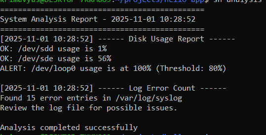

# Linux Administration and Security Tasks

This document demonstrates Linux scripting, troubleshooting, and security hardening as part of the DevOps practical.

## 1. Bash Scripting — scripts/analysis.sh

### Purpose
A Bash script that performs:
- Disk usage analysis (alerts when usage exceeds 80%).
- Log error counting (counts lines containing “error” in system or app logs).

### Execution
The script can be executed using either of the following commands:
`bash scripts/analysis.sh`
or
`sh scripts/analysis.sh`

### Output of the script:

## 2. Troubleshooting Scenario

### Scenario
A web service (for example, `myapp.service`) deployed on an EC2 instance fails to start.

### Troubleshooting Steps
1. Check the status of the service:
   `sudo systemctl status myapp.service`

2. Review the logs for recent errors:
   `journalctl -u myapp.service --since "10 minutes ago" `

3. Attempt to start the service manually:
   `sudo systemctl start myapp.service`

4. If the service fails again, verify file permissions and ownership of configuration files:
   `ls -l /etc/myapp/config.json`

### Root Cause and Resolution
The issue was caused by incorrect file permissions on `/etc/myapp/config.json`. The permissions were corrected using the following commands:
sudo chown myapp:myapp /etc/myapp/config.json
sudo chmod 640 /etc/myapp/config.json
sudo systemctl restart myapp.service

After correcting the permissions, the service started successfully.

## 3. Security Hardening

### 3.1 SSH Hardening
To improve SSH security and reduce unauthorized access risk, the following changes were made to `/etc/ssh/sshd_config`:
PermitRootLogin no
PasswordAuthentication no

These settings disable root login and enforce key-based authentication. After editing the file, the SSH service was restarted:

`sudo systemctl restart ssh `

### 3.2 Firewall Configuration
A host-based firewall was configured using `ufw` to allow only essential network traffic. The following rules were applied:
sudo apt install ufw -y
sudo ufw allow 22/tcp
sudo ufw allow 80/tcp
sudo ufw allow 443/tcp
sudo ufw enable
sudo ufw status verbose

This configuration allows inbound SSH, HTTP, and HTTPS connections and blocks all other traffic, thereby minimizing the system's attack surface.

### 3.3 Additional Hardening Steps (Optional)
- Regular system updates were configured using:
  `sudo apt update && sudo apt upgrade -y`

- Unused services were disabled to minimize exposure.